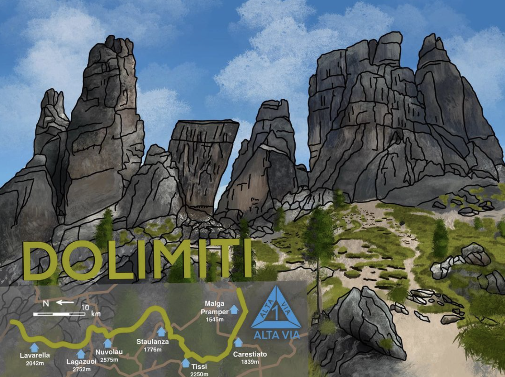
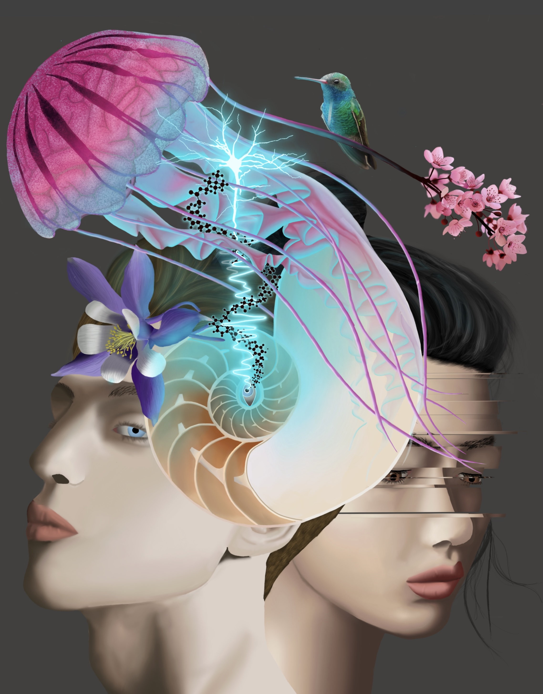
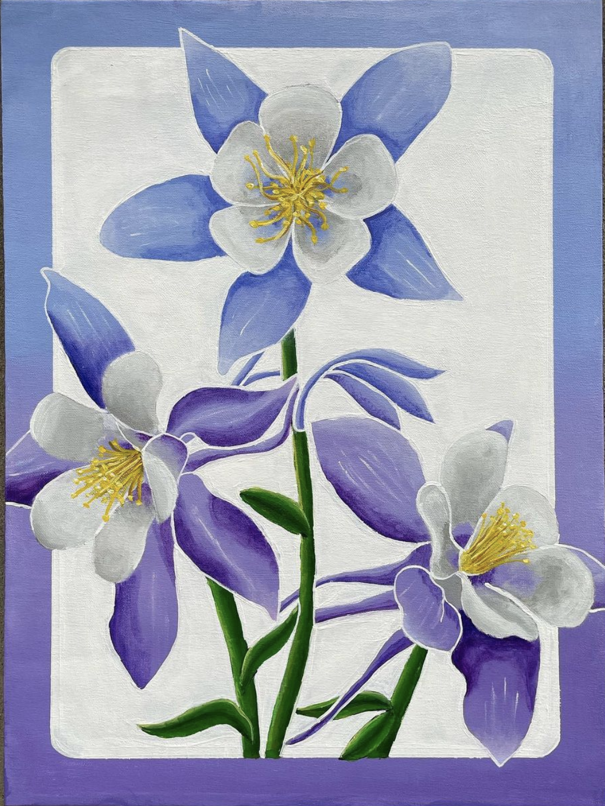
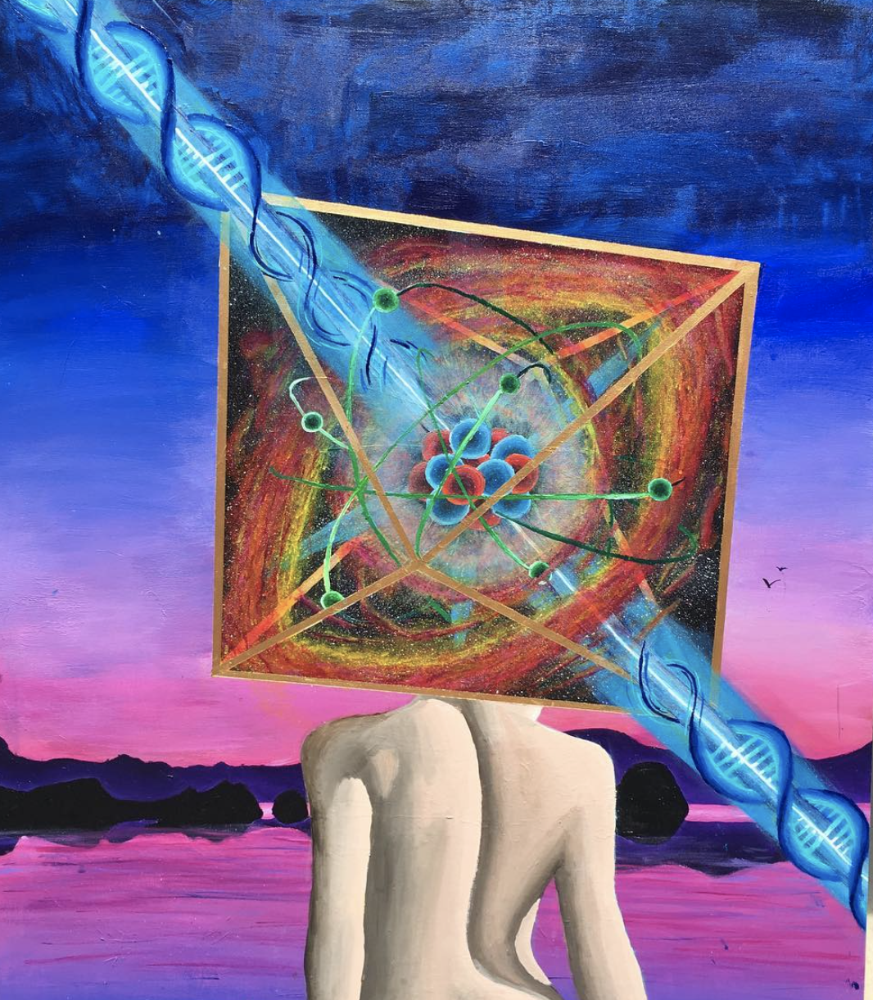

This page includes the art I make. Some if it is neuroscience related, and some of it is not. Enjoy!

---

# Digital (Vector and Rastor)

{width=50%}

### Sliced - 2023

{width=50%}

### Dolimiti: Alta Via Una - 2023

{width=50%}

### Bloom - 2022

{width=50%}

### Neuronal Activity - 2021

{width=50%}

### Germinate; Colab with Trey Brasher - 2021

{width=50%}

### Resting State - 2020

{width=50%}

### Self Portrait - 2020

{width=50%}

### Blooming In Harmony With Nature - 2020

{width=50%}

### Mind Manifesting - 2020

{width=50%}

### Reaching For Happiness - 2019

---

# Painting

{width=50%}

### Colorful Columbines - 2022

{width=50%}

### Carbon Based Lifeforms - 2018

{width=50%}

### Ankor Wat - 2016

--- 

# Ceramics

{width=50%}

{width=50%}
{width=50%}

---

# Generative 

Come back soon!!!

{width=50%}

### Hexs - From a Workshop

--- 

