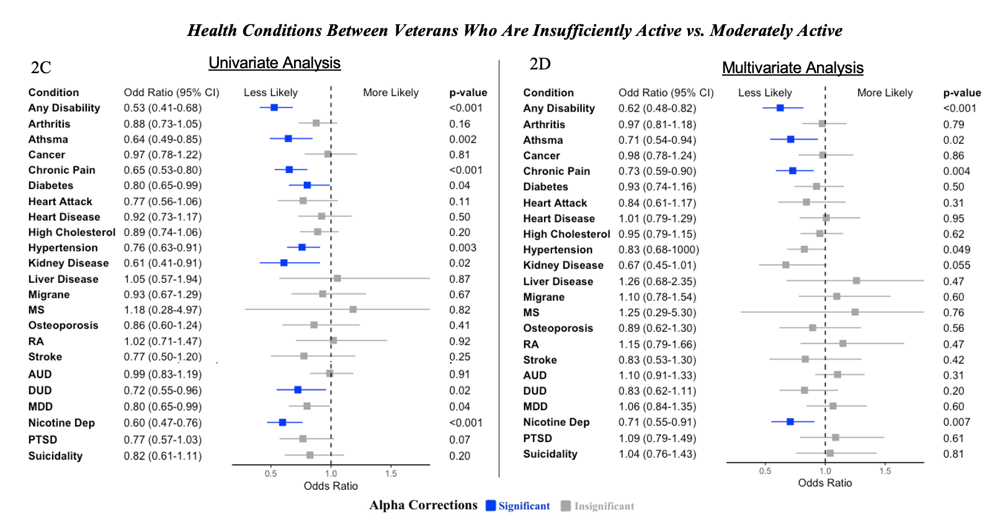
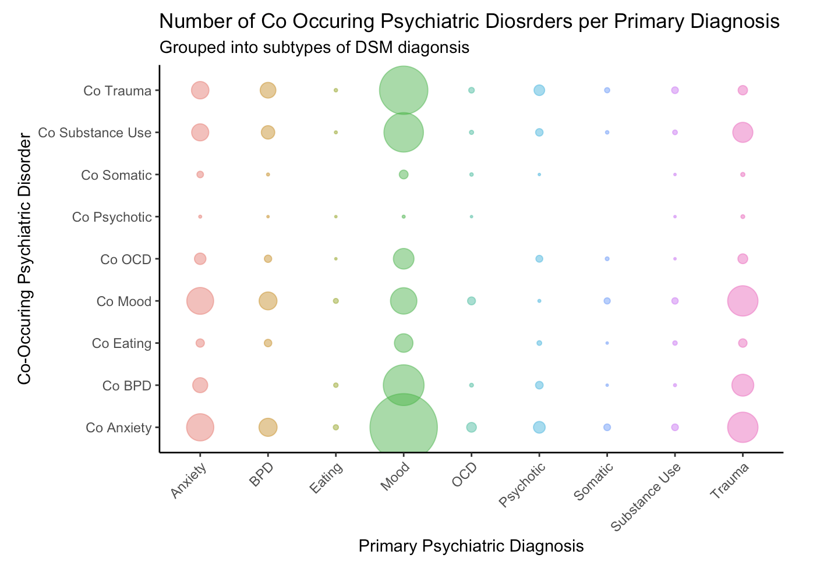
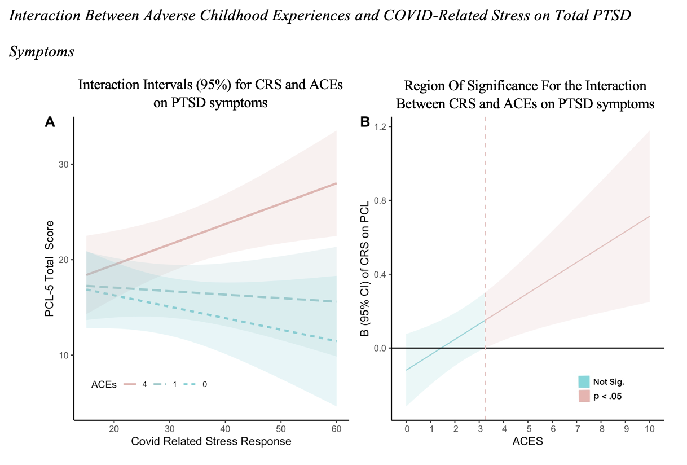

```{r setup, include=FALSE}
knitr::opts_chunk$set(echo = TRUE)
```

This page contains links to code used for manuscripts, projects, presentations, or projects I coded for fun. For access to the my github please click [HERE](https://github.com/Troy-Hubert)

---

### [1. Masters Thesis Project](https://troy-hubert.github.io/Thesis/)

{width=50%}

This code shows the analyses (multinomial logistic regressions) ran for my masters thesis. This project looks at how physical activity levels correlate with physical and mental health conditions. 

--- 

### [2. Visualizing Hospital Data](https://troy-hubert.github.io/Hospital_Visualizations/)

{width=50%}

This code shows visualizes who attends a partial hospitalization program (PHP), diagnoses of patients in the program, how patients progress through treatment, and the outcomes of their treatment programs. 

---

### [3. Child Adversity, Stress From Covid, and Posttruamatic Stress](https://troy-hubert.github.io/ACES-CRS/)

{width=50%}

This code was used for the manuscript _The Interactive Effect of COVID-Related Stress and Adverse Childhood Experiences on Post Traumatic Stress Disorder Symptoms in Adults._ The code shows analysis (moderation analysis [PROCESS]) and visualizations of interactions.

